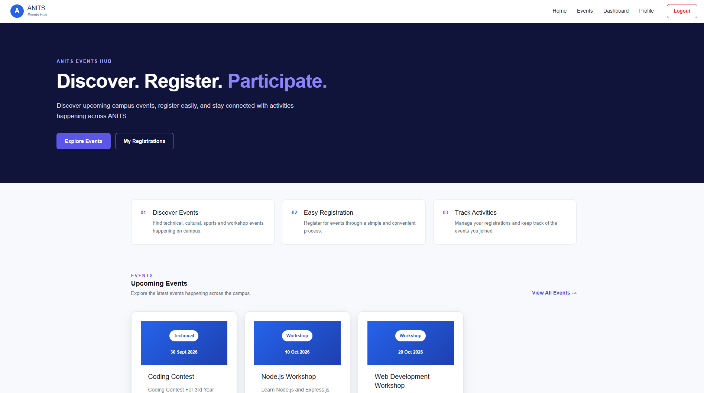
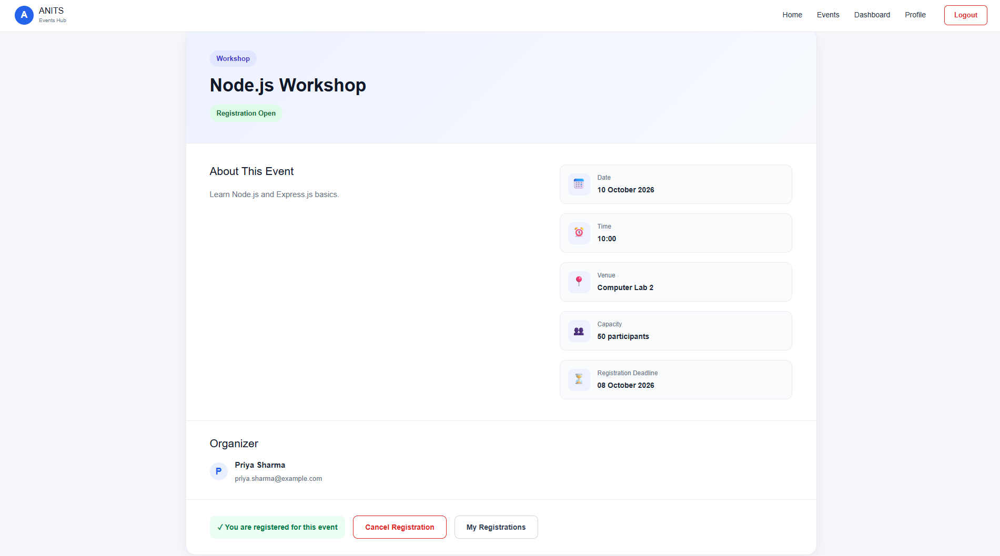
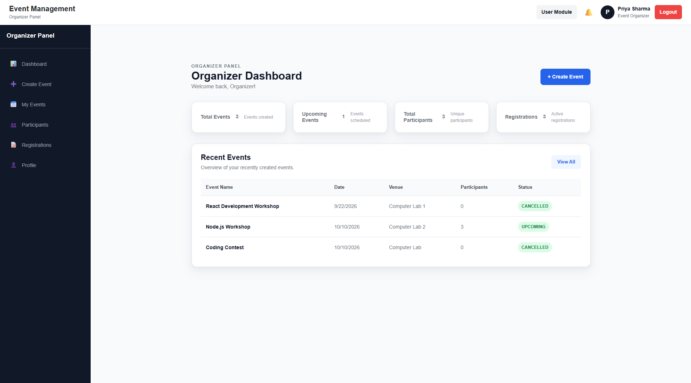
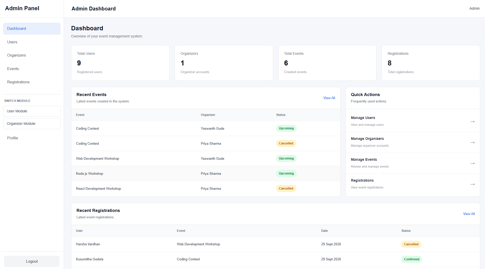

# College Event Management System

A full-stack MERN web application that lets students discover and register for campus events, while organizers and administrators manage events, users, and registrations through dedicated dashboards.

**Live Demo:** [event-management-system-one-black.vercel.app](https://event-management-system-one-black.vercel.app)

---

## Table of Contents

- [Features](#features)
- [Tech Stack](#tech-stack)
- [User Roles](#user-roles)
- [Project Structure](#project-structure)
- [Getting Started](#getting-started)
- [Environment Variables](#environment-variables)
- [Scripts](#scripts)
- [Screenshots](#screenshots)
- [Contributing](#contributing)
- [License](#license)
- [Author](#author)

---

## Features

**Authentication and Authorization**
- JWT-based authentication for secure login and protected routes
- Role-based access control for `USER`, `ORGANIZER`, and `ADMIN` roles

**For Students (USER)**
- Browse and discover upcoming campus events
- Register for events and cancel registrations
- Track registration status

**For Organizers (ORGANIZER)**
- Dedicated dashboard for organizer workflows
- Create and manage events
- Monitor registrations for their events

**For Administrators (ADMIN)**
- Dedicated dashboard with platform statistics
- User management and event monitoring
- Registration tracking across the platform

**Registration Rules**
- Capacity validation to prevent over-enrollment
- Deadline-based registration restrictions
- Cancellation and status tracking

---

## Tech Stack

| Layer | Technologies |
| --- | --- |
| Frontend | React.js, Vite, Bootstrap, React Router, Axios |
| Backend | Node.js, Express.js |
| Database | MongoDB, Mongoose |
| Authentication | JSON Web Tokens (JWT) |
| Deployment | Vercel |

---

## User Roles

| Role | Access |
| --- | --- |
| `USER` | Discover events, register, cancel, and view registration status |
| `ORGANIZER` | Manage own events and view registrations, plus all `USER` access |
| `ADMIN` | Manage users, events, and registrations, and view platform statistics |

---

## Project Structure

```
Event-Management-System/
├── backend/                 # Node.js + Express REST API
│   ├── controllers/
│   ├── middleware/
│   ├── models/
│   ├── routes/
│   └── server.js
├── frontend/                # React + Vite client
│   └── src/
│       ├── components/
│       ├── pages/
│       ├── routes/
│       ├── services/
│       ├── context/
│       └── hooks/
├── CONTRIBUTING.md
├── LICENSE
└── README.md
```

---

## Getting Started

### Prerequisites

- [Node.js](https://nodejs.org/) (v18 or later recommended)
- [MongoDB](https://www.mongodb.com/) (local instance or MongoDB Atlas)
- npm

### Installation

1. **Clone the repository**

   ```bash
   git clone https://github.com/YaswanthGude-cmd/Event-Management-System.git
   cd Event-Management-System
   ```

2. **Set up the backend**

   ```bash
   cd backend
   npm install
   ```

   Create a `.env` file in the `backend` folder (see [Environment Variables](#environment-variables)), then start the server:

   ```bash
   npm run dev
   ```

3. **Set up the frontend**

   Open a new terminal:

   ```bash
   cd frontend
   npm install
   npm run dev
   ```

4. **Open the app**

   Visit `http://localhost:5173` in your browser.

---

## Environment Variables

Create a `.env` file inside the `backend` folder:

```env
PORT=5000
MONGO_URI=your_mongodb_connection_string
JWT_SECRET=your_jwt_secret_key
```

If the frontend reads the API URL from an environment variable, create a `.env` file inside the `frontend` folder:

```env
VITE_API_URL=http://localhost:5000
```

> Never commit `.env` files to version control.

---

## Scripts

| Location | Command | Description |
| --- | --- | --- |
| `backend` | `npm run dev` | Start the API server in development mode |
| `backend` | `npm start` | Start the API server in production mode |
| `frontend` | `npm run dev` | Start the Vite development server |
| `frontend` | `npm run build` | Create a production build |
| `frontend` | `npm run preview` | Preview the production build locally |

---

## Screenshots

<!-- Add screenshots to a /screenshots folder and link them here -->

| Home | Event Details |
| --- | --- |
|  |  |

| Organizer Dashboard | Admin Dashboard |
| --- | --- |
|  |  |

---

## Contributing

Contributions are welcome. Please read [CONTRIBUTING.md](CONTRIBUTING.md) before opening a pull request.

1. Fork the repository
2. Create a feature branch: `git checkout -b feature/your-feature`
3. Commit your changes: `git commit -m "Add your feature"`
4. Push to the branch: `git push origin feature/your-feature`
5. Open a pull request

---

## License

This project is licensed under the MIT License. See the [LICENSE](LICENSE) file for details.

---

## Author

**Yaswanth Gude**
Frontend | Full Stack Developer

- GitHub: [YaswanthGude-cmd](https://github.com/YaswanthGude-cmd)
- LinkedIn: [yaswanth-gude-50813b322](https://linkedin.com/in/yaswanth-gude-50813b322)
- Email: gudeyaswanth017@gmail.com
